# FLUJO Strategic Enhancement Project Plan

## Executive Summary

This document outlines a comprehensive enhancement plan for FLUJO, focusing on advanced MCP (Model Context Protocol) optimization, architectural improvements, and platform capabilities. The plan transforms FLUJO from a visual workflow orchestration platform into an intelligent AI orchestration platform capable of autonomous decision-making, learning, and optimization.

**Strategic Vision**: Transform FLUJO into an intelligent AI orchestration platform through enhanced MCP optimization, memory systems, reasoning capabilities, and self-optimization features.

**Implementation Methodology**: **REVISED MCP-First approach** with **comprehensive task definition** ensuring all implementations match actual codebase structure and capabilities.

---

## 🚨 **CRITICAL PROJECT STATUS UPDATE**

**Date**: June 3, 2025  
**Status**: Task definitions updated with actual codebase analysis  
**Issue Identified**: Previous task documentation assumed implementations that don't exist  
**Resolution**: Complete task redefinition based on real FLUJO codebase structure  

### **Key Changes Made:**
1. **Comprehensive codebase analysis** completed
2. **Task B1 completely redefined** with accurate requirements
3. **Implementation gaps identified** and documented
4. **Proper task definition checklist** created for all future tasks

---

## 🎯 TACTICAL IMPLEMENTATION APPROACH - MCP-FIRST PRIORITIZATION

### **UPDATED PRIORITY STRUCTURE** 

Based on comprehensive codebase analysis and actual implementation requirements:

#### **Task Categories & Dependencies (Verified)**

```mermaid
graph TD
    B[Category B: Enhanced MCP Integration<br/>Week 1-3] --> B_PRIORITY[🧠 IMMEDIATE PRIORITY - Foundation Required]
    C[Category C: Memory & Learning<br/>Week 4-8] --> C_DEPENDS[⚠️ Requires Category B Complete]
    D[Category D: Advanced Orchestration<br/>Week 9-14] --> D_DEPENDS[⚠️ Requires B + C Complete]
    A[Category A: Audio Transcription<br/>Week 15-16] --> A_DEFERRED[⏸️ Deferred - Independent Feature]
    E[Category E: Analytics & Optimization<br/>Week 17-22] --> E_DEPENDS[⚠️ Requires B + C + D Complete]
    F[Category F: Maintenance & Infrastructure<br/>Throughout] --> F_PARALLEL[🔄 Runs in Parallel]
```



### **Current Implementation Status**

**🔍 CURRENT TASK**: **Task B1 - Flow Intelligence Enhancement** - **DEFINITION PHASE**
- **Status**: ❌ **NOT READY FOR IMPLEMENTATION**
- **Issue**: Previous documentation assumed non-existent implementations
- **Action Required**: Complete **[Task Definition Checklist](./docs/tasks/task-b1-complete-definition.md)**
- **GitHub Issue**: [#5 Flow Intelligence Enhancement](https://github.com/joelfuller2016/FLUJO/issues/5)

**⚠️ CRITICAL FINDING**: MCPHandler.executeMCP() currently only lists tools - doesn't execute them

---

## Overview

FLUJO currently provides excellent foundation capabilities including visual flow design, MCP server integration, model management, and conversation handling. However, comprehensive analysis reveals significant gaps between planned enhancements and actual implementation requirements.

## Current State Analysis

### 🏗️ Existing Architecture Strengths

**Flow Management System**
- JSON-based flow definitions with persistent storage
- React Flow visual interface with PocketFlow execution engine
- Comprehensive node types: start, process, mcp, finish
- Edge-based flow control with branching and loops

**MCP Integration** *(Verified Structure)*
- Robust server management with STDIO transport
- 15+ MCP servers available in `/mcp-servers/` directory
- Basic tool listing capability in MCPHandler
- Environment variable binding with encryption
- Support for GitHub, local, Docker, and SSE servers

**Available MCP Servers** *(Confirmed)*
- `code-reasoning` - Available for advanced reasoning
- `sequential-thinking` - Step-by-step problem solving  
- `memory` - Knowledge graph for persistent learning
- `taskmanager` - Task decomposition and workflow management
- Desktop Commander, GitHub, file system tools, etc.

**Conversation Management**
- Individual JSON file storage per conversation
- Flow execution tracking with node-level state
- Message persistence with timestamps and associations

### 🎯 Enhancement Opportunities *(Verified)*

1. **Intelligent MCP Orchestration**: MCPHandler needs actual tool execution capability
2. **Advanced Flow Patterns**: Reasoning integration missing from FlowExecutor
3. **Performance Optimization**: Foundation infrastructure exists but needs reasoning layer
4. **Context-Aware Processing**: Memory integration planned but depends on reasoning
5. **Enterprise Features**: Analytics requires foundational intelligence capabilities

---

## Strategic Enhancement Phases

### Phase 1: Enhanced MCP Integration (Weeks 1-3) 🧠 **CURRENT PRIORITY**
**Tactical Implementation**: Category B Tasks (B1-B8)

#### 1.1 Flow Intelligence Enhancement (Issue #5) - **TASK B1**
**Status**: 🔍 **COMPREHENSIVE DEFINITION REQUIRED**

**Critical Issues Identified:**
- **MCPHandler Limitation**: Currently only lists tools via `mcpService.listServerTools()`
- **Missing Tool Execution**: No capability to actually call MCP tools with parameters
- **Type Definitions Missing**: FlowOptimizationResult, OptimizationSuggestion interfaces don't exist
- **Integration Points Unclear**: FlowExecutor.executeStep() needs specific modification points identified

**Complete Task Definition**: **[📋 Task B1 Complete Definition](./docs/tasks/task-b1-complete-definition.md)**

**Before Implementation Can Begin:**
1. ✅ **Complete Phase 1 Foundation Verification** - Verify mcp-reasoner availability and MCPHandler capabilities
2. ❌ **Enhance MCPHandler for tool execution** - Currently only lists tools, needs execution capability  
3. ❌ **Add reasoning-specific types** - Missing FlowOptimizationResult and related interfaces
4. ❌ **Create reasoning service structure** - ReasonerIntegrationService doesn't exist
5. ❌ **Plan FlowExecutor integration points** - Specific modification locations needed

**Implementation Tasks** *(After Definition Complete)*:
- **B1**: Complete Task Definition and Foundation Verification (CURRENT)
- **B2**: MCPHandler Enhancement for Tool Execution (4-5 hours)
- **B3**: FlowExecutor Reasoning Integration (3-4 hours)  
- **B4**: ReasonerIntegrationService Implementation (4-5 hours)
- **B5**: Testing and Performance Validation (3-4 hours)

#### 1.2 Dynamic Branching Logic (Issue #6)
**Status**: 🔴 **BLOCKED** - Requires B1 completion
**Objective**: Replace static branching with intelligent decision-making using sequential-thinking

**Dependencies**: 
- MCPHandler tool execution capability (from B1)
- Reasoning integration infrastructure (from B1)

### Phase 2: Memory & Learning (Weeks 4-8)
**Tactical Implementation**: Category C Tasks (C1-C8)  
**Status**: 🔴 **BLOCKED** - Requires Phase 1 reasoning foundation

#### 2.1 Memory Service Integration (Issue #7)
**Objective**: Enable cross-conversation learning and pattern storage using memory MCP server

**Dependencies**: Enhanced reasoning capabilities from Phase 1

### Phase 3: Advanced Orchestration (Weeks 9-14)
**Tactical Implementation**: Category D Tasks (D1-D8)  
**Status**: 🔴 **BLOCKED** - Requires Phases 1-2 completion

#### 3.1 Natural Language to Flow Generation (Issue #8)
**Objective**: AI-assisted workflow creation using taskmanager MCP and reasoning

**Dependencies**: Reasoning + Memory systems from Phases 1-2

### Phase 4: Analytics & Self-Optimization (Weeks 17-22)
**Tactical Implementation**: Category E Tasks (E1-E8)  
**Status**: 🔴 **BLOCKED** - Requires all previous phases

### Ongoing: Category F - Maintenance & Infrastructure
**Parallel execution throughout project timeline**:
- **F1**: Testing Infrastructure - Unit & Integration (3-4 hours)
- **F2**: Testing Infrastructure - Performance & E2E (3-4 hours)  
- **F3**: Documentation - Technical & User Guides (4-5 hours)
- **F4**: Security & Compliance Review (3-4 hours)
- **F5**: Deployment & Production Setup (4-5 hours)
- **F6**: Performance Monitoring & Optimization (3-4 hours)

---

## 🚀 IMMEDIATE IMPLEMENTATION PATH

### **STEP 1: COMPLETE TASK B1 DEFINITION** *(CURRENT REQUIREMENT)*

**📋 Work through comprehensive checklist**: [Task B1 Complete Definition](./docs/tasks/task-b1-complete-definition.md)

**Phase 1 Foundation Verification Checklist:**
- [ ] **Verify mcp-reasoner server availability** - Check `/mcp-servers/code-reasoning/` functionality
- [ ] **Assess MCPHandler limitations** - Confirm tool execution capability gap
- [ ] **Test existing MCP service capabilities** - Verify `mcpService.callTool()` methods exist
- [ ] **Create missing type definitions** - Add FlowOptimizationResult and related interfaces  
- [ ] **Plan service infrastructure** - Design ReasonerIntegrationService structure
- [ ] **Specify FlowExecutor integration** - Identify exact modification points
- [ ] **Design testing approach** - Unit tests, integration tests, performance benchmarks
- [ ] **Document implementation requirements** - Specific file changes and new code needed

**Critical Success Criteria for Task B1 Readiness:**
1. **mcp-reasoner server confirmed operational**
2. **MCPHandler tool execution capability confirmed or enhancement plan defined**
3. **All reasoning-specific types defined**  
4. **Clear implementation specification with exact file modifications**
5. **Testing infrastructure planned with success criteria**

### **STEP 2: IMPLEMENT TASK B1** *(After Definition Complete)*

Only after completing all Phase 1 verification items can actual implementation begin:

1. **Enhance MCPHandler** - Add actual tool execution capability
2. **Integrate reasoning in FlowExecutor** - Add pre-execution analysis
3. **Create ReasonerIntegrationService** - High-level reasoning abstraction
4. **Add comprehensive testing** - Unit, integration, and performance tests
5. **Update documentation** - API docs and usage examples

---

## Implementation Strategy

### Development Approach

#### 1. **Comprehensive Task Definition First**
- **Current Phase**: Complete task definition and verification before any implementation
- **Methodology**: Analyze actual codebase structure vs. planned enhancements
- **Quality Gate**: All foundation verification items must be complete
- **Documentation**: Accurate technical specifications based on real code structure

#### 2. Quality Assurance
- Comprehensive unit and integration testing
- Performance benchmarking at each phase
- Security vulnerability scanning  
- User acceptance testing with real scenarios

#### 3. Risk Management
- **Task-level verification** before implementation begins
- **Foundation validation** with Phase 1 comprehensive checklist
- **Incremental validation** through systematic testing
- **Rollback capability** with version control and feature flags

### Technical Architecture Enhancements *(Verified Structure)*

#### Backend Services (Actual File Structure)
```
src/backend/
├── execution/flow/
│   ├── FlowExecutor.ts                    # ✅ EXISTS - Needs reasoning integration
│   ├── handlers/
│   │   ├── MCPHandler.ts                  # ✅ EXISTS - Needs tool execution capability
│   │   └── [NEW] ReasoningHandler.ts      # ❌ MISSING - Needs creation
│   └── types.ts                           # ✅ EXISTS - Needs reasoning types
├── services/
│   ├── mcp/
│   │   ├── index.ts                       # ✅ EXISTS - MCP service infrastructure  
│   │   ├── tools.ts                       # ✅ EXISTS - Tool management
│   │   └── [NEW] reasoner-integration.ts  # ❌ MISSING - Needs creation
│   └── [NEW] reasoning/                   # ❌ MISSING - Service directory needed
```

#### Frontend Components (Future Enhancement)
```
src/frontend/components/
├── Flow/
│   ├── [NEW] IntelligentNodes/            # Phase 1 UI components
│   ├── [NEW] OptimizationPanel/          # Reasoning insights display  
│   └── [NEW] ReasoningDisplay/            # Analysis visualization
```

## Success Metrics & KPIs

### MCP Intelligence Metrics (Priority)
- **Foundation Verification**: 100% of Phase 1 checklist completed before implementation
- **MCPHandler Enhancement**: Actual tool execution with < 100ms latency overhead
- **Reasoning Integration**: Successful mcp-reasoner calls with result processing
- **Error Handling**: Graceful fallback when reasoning unavailable

### Traditional Performance Metrics
- **System Reliability**: No degradation of existing functionality
- **Integration Success**: All existing MCP workflows continue working
- **Performance Impact**: < 10% execution time increase with reasoning enabled
- **Code Quality**: 100% test coverage for new reasoning functionality

## Timeline & Milestones (Updated with Reality Check)

### **IMMEDIATE (Current): Task B1 Definition Phase**
- 🔍 **Current**: Complete comprehensive task definition checklist
- 🎯 **Goal**: Verified foundation and clear implementation specification
- 🎁 **Deliverable**: Ready-to-implement Task B1 with all requirements defined
- 📋 **Document**: [Task B1 Complete Definition](./docs/tasks/task-b1-complete-definition.md)

### **Phase 1 (After Definition): Enhanced MCP Integration** 
- 🎯 **Goal**: Functional reasoning integration with mcp-reasoner
- 🎁 **Deliverable**: FlowExecutor with intelligent analysis and optimization suggestions
- 📊 **Success Criteria**: Reasoning calls work end-to-end with proper error handling

### **Phase 2 (Future): Memory & Learning**
- 🎯 **Goal**: Cross-conversation learning using memory MCP server
- 🎁 **Deliverable**: Pattern recognition and user preference tracking
- 📋 **Prerequisites**: Completed Phase 1 reasoning integration

### **Phase 3 (Future): Advanced Orchestration**  
- 🎯 **Goal**: Natural language to flow generation
- 🎁 **Deliverable**: AI-powered workflow creation from descriptions
- 📋 **Prerequisites**: Completed Phases 1-2

### **Phase 4 (Future): Analytics & Self-Optimization**
- 🎯 **Goal**: Self-optimizing platform with comprehensive analytics
- 🎁 **Deliverable**: Autonomous optimization and performance monitoring
- 📋 **Prerequisites**: Completed Phases 1-3

## Resource Requirements

### Development Team
- **2 Senior Full-Stack Developers**: Core platform development (MCP integration focus)
- **1 DevOps Engineer**: Infrastructure and deployment (Category F)
- **1 ML/AI Engineer**: AI optimization features (Categories B, C, D, E)  
- **1 UX Designer**: Interface design and user experience (reasoning UI focus)
- **1 QA Engineer**: Testing and quality assurance (Category F)

### Infrastructure
- **Development Environment**: Containerized development stack
- **Testing Infrastructure**: Automated testing pipeline (Category F)
- **MCP Server Environment**: Verified mcp-reasoner and other MCP servers
- **Monitoring Tools**: Performance and security monitoring (Category F)

---

## 🎯 GETTING STARTED

### For Development Team

**IMMEDIATE ACTION**: Complete Task B1 Definition Phase
1. **Review Complete Task Definition**: [Task B1 Complete Definition](./docs/tasks/task-b1-complete-definition.md)
2. **Work Through Phase 1 Checklist**: Foundation verification before implementation
3. **Verify MCP Infrastructure**: Confirm mcp-reasoner availability and MCPHandler capabilities
4. **Plan Implementation Approach**: Based on actual codebase analysis
5. **No Implementation Until**: All foundation verification items completed

### For Project Managers

**TRACKING**: Systematic task definition and verification
1. **Current Phase**: Task definition and foundation verification  
2. **Quality Gate**: No implementation without complete task definition
3. **Progress Tracking**: Phase 1 checklist completion percentage
4. **Risk Management**: Prevent implementation of incorrectly defined tasks

### For Stakeholders

**VISIBILITY**: Transparent project status with accurate technical foundation
1. **Current Status**: Task definition phase to ensure implementation accuracy
2. **Quality Assurance**: Comprehensive verification before implementation begins
3. **Timeline Impact**: Definition phase adds time upfront but prevents rework
4. **Long-term Benefit**: Accurate implementation reduces project risk and improves success probability

## Conclusion

This enhanced project plan addresses **critical gaps** between planned enhancements and actual FLUJO codebase capabilities. The **task definition phase** ensures:

- **100% accurate implementation specifications** based on real code structure
- **Verified technical foundations** before implementation begins  
- **Clear success criteria** with measurable outcomes
- **Risk reduction** through comprehensive upfront analysis

The systematic **MCP-first approach** with **comprehensive task definition** eliminates execution uncertainty while maintaining ambitious intelligence goals.

**Current Priority**:
1. 📋 **Complete Task B1 Definition**: Work through comprehensive checklist
2. 🔍 **Verify All Prerequisites**: Ensure foundation is solid before implementation  
3. 🎯 **Begin Implementation**: Only after all definition criteria met
4. 🚀 **Execute Systematic Plan**: Follow verified specifications for enhanced success

For questions or modifications to this plan, please open an issue or contact the development team.

---

*Last Updated: June 3, 2025*  
*Version: 5.0 - Comprehensive Task Definition with Codebase Analysis*  
*Status: Task B1 Definition Phase - Foundation Verification Required*  
*Critical Document: [Task B1 Complete Definition](./docs/tasks/task-b1-complete-definition.md)*