# FLUJO Strategic Enhancement Project Plan

## Executive Summary

This document outlines a comprehensive enhancement plan for FLUJO, focusing on advanced MCP (Model Context Protocol) optimization, architectural improvements, and platform capabilities. The plan transforms FLUJO from a visual workflow orchestration platform into an intelligent AI orchestration platform capable of autonomous decision-making, learning, and optimization.

**Strategic Vision**: Transform FLUJO into an intelligent AI orchestration platform through enhanced MCP optimization, memory systems, reasoning capabilities, and self-optimization features.

**Implementation Methodology**: MCP-First approach prioritizing intelligent reasoning capabilities as the foundation for all other enhancements, with systematic task breakdown for 85% success probability.

---

## 🎯 TACTICAL IMPLEMENTATION APPROACH - MCP-FIRST PRIORITIZATION

### **NEW PRIORITY STRUCTURE** 

Based on strategic analysis and user requirements for enhanced MCP tools and chain of thought management, the implementation priority has been restructured:

#### **Task Categories & Dependencies (Updated)**

```mermaid
graph TD
    B[Category B: Enhanced MCP Integration<br/>Week 1-3] --> B_PRIORITY[🧠 IMMEDIATE PRIORITY - Foundational]
    C[Category C: Memory & Learning<br/>Week 4-8] --> C_DEPENDS[⚠️ Requires Category B]
    D[Category D: Advanced Orchestration<br/>Week 9-14] --> D_DEPENDS[⚠️ Requires B + C]
    A[Category A: Audio Transcription<br/>Week 15-16] --> A_DEFERRED[⏸️ Deferred - Independent Feature]
    E[Category E: Analytics & Optimization<br/>Week 17-22] --> E_DEPENDS[⚠️ Requires B + C + D]
    F[Category F: Maintenance & Infrastructure<br/>Throughout] --> F_PARALLEL[🔄 Runs in Parallel]
```



### **Current Implementation Status**

**🧠 IMMEDIATE PRIORITY**: **Category B - Enhanced MCP Integration**
- **Request ID**: req-43
- **Current Task**: task-380 (PROJECT_PLAN.md Update) → task-381 (mcp-reasoner Integration)
- **GitHub Issues**: #5 (Flow Intelligence), #6 (Dynamic Branching)
- **Strategic Benefit**: Foundation for ALL intelligent features

---

## Overview

FLUJO currently provides excellent foundation capabilities including visual flow design, MCP server integration, model management, and conversation handling. This plan strategically enhances these capabilities with intelligent automation, performance optimization, and advanced workflow patterns.

## Current State Analysis

### 🏗️ Existing Architecture Strengths

**Flow Management System**
- JSON-based flow definitions with persistent storage
- React Flow visual interface with PocketFlow execution engine
- Comprehensive node types: start, process, mcp, finish
- Edge-based flow control with branching and loops

**MCP Integration**
- Robust server management with STDIO transport
- 15+ MCP servers already integrated in `/mcp-servers/`
- Granular tool selection per workflow node
- Environment variable binding with encryption
- Support for GitHub, local, Docker, and SSE servers

**Available MCP Servers**
- `mcp-reasoner` - Advanced reasoning with beam search, MCTS strategies
- `sequential-thinking` - Step-by-step problem solving with branching
- `memory` - Knowledge graph for persistent learning
- `taskmanager` - Task decomposition and workflow management
- `code-reasoning` - Specialized reasoning for development tasks

**Conversation Management**
- Individual JSON file storage per conversation
- Flow execution tracking with node-level state
- Message persistence with timestamps and associations

### 🎯 Enhancement Opportunities

1. **Intelligent MCP Orchestration**: Dynamic server selection and load balancing
2. **Advanced Flow Patterns**: Conditional execution and adaptive routing
3. **Performance Optimization**: Caching, parallel execution, and resource management
4. **Context-Aware Processing**: Learning from execution patterns
5. **Enterprise Features**: Monitoring, analytics, and scalability

---

## Strategic Enhancement Phases

### Phase 1: Enhanced MCP Integration (Weeks 1-3) 🧠 **CURRENT PRIORITY**
**Tactical Implementation**: Category B Tasks (B1-B8)

#### 1.1 Flow Intelligence Enhancement (Issue #5)
**Objective**: Integrate mcp-reasoner into FLUJO's core execution engine

**Technical Implementation**:
```typescript
// Location: src/backend/execution/flow/FlowExecutor.ts
export class EnhancedFlowExecutor {
  static async analyzeFlowOptimization(
    sharedState: SharedState
  ): Promise<FlowOptimizationResult> {
    const reasoningResult = await MCPHandler.executeMCP({
      mcpServer: 'mcp-reasoner',
      enabledTools: ['mcp-reasoner'],
      context: {
        messages: sharedState.messages,
        currentFlow: sharedState.flowId,
        executionHistory: sharedState.debugSteps,
        performanceMetrics: sharedState.metrics
      },
      task: 'analyze_flow_performance_and_suggest_optimizations'
    });
    
    return {
      suggestions: reasoningResult.value.suggestions,
      alternativePaths: reasoningResult.value.alternatives,
      performanceMetrics: reasoningResult.value.metrics,
      confidence: reasoningResult.value.confidence
    };
  }
}
```

**Implementation Tasks**:
- **B1**: MCP-Reasoner Integration Setup (2-3 hours) **NEXT TASK**
- **B2**: Flow Analysis Service Implementation (4-5 hours)
- **B3**: Performance Optimization Suggestions (3-4 hours)
- **B8**: Performance Tracking Infrastructure (3-4 hours)

#### 1.2 Dynamic Branching Logic (Issue #6)
**Objective**: Replace static branching with intelligent decision-making

**Technical Implementation**:
```typescript
// New file: src/backend/execution/flow/handlers/BranchingHandler.ts
export class BranchingHandler {
  static async executeIntelligentBranching(
    input: MCPExecutionInput,
    context: ConversationContext,
    availableNodes: MCPNodeConfig[]
  ): Promise<BranchingDecision> {
    
    const thinkingResult = await MCPHandler.executeMCP({
      mcpServer: 'sequential-thinking',
      enabledTools: ['sequentialthinking'],
      context: {
        conversation: context.messages,
        availableOptions: availableNodes,
        currentState: context.sharedState,
        executionHistory: context.executionHistory
      },
      task: 'determine_optimal_next_action_with_reasoning'
    });
    
    return {
      selectedNodes: thinkingResult.value.recommendedNodes,
      reasoning: thinkingResult.value.reasoning,
      confidence: thinkingResult.value.confidence,
      alternativePaths: thinkingResult.value.alternatives
    };
  }
}
```

**Implementation Tasks**:
- **B4**: Sequential-Thinking Integration (4-5 hours)
- **B5**: Dynamic Branching Implementation (4-5 hours)
- **B6**: Context-Aware Tool Selection (3-4 hours)
- **B7**: Branching UI & Debug Tools (3-4 hours)

### Phase 2: Memory & Learning (Weeks 4-8)
**Tactical Implementation**: Category C Tasks (C1-C8)

#### 2.1 Memory Service Integration (Issue #7)
**Objective**: Enable cross-conversation learning and pattern storage

**Implementation Tasks**:
- **C1**: Memory MCP Server Integration (2-3 hours)
- **C2**: FlowMemoryService Implementation (4-5 hours)
- **C3**: Flow Pattern Storage System (4-5 hours)
- **C4**: Cross-Conversation Context (3-4 hours)

#### 2.2 Advanced Workflow Patterns
**Objective**: Support sophisticated workflow patterns for complex automation

**Implementation Tasks**:
- **C5**: User Preference Tracking (3-4 hours)
- **C6**: Enhanced Conversation Management (3-4 hours)
- **C7**: Knowledge Graph UI Components (4-5 hours)
- **C8**: Flow Builder Memory Integration (3-4 hours)

### Phase 3: Advanced Orchestration (Weeks 9-14)
**Tactical Implementation**: Category D Tasks (D1-D8)

#### 3.1 Natural Language to Flow Generation (Issue #8)
**Objective**: AI-assisted workflow creation and optimization

**Implementation Tasks**:
- **D1**: FlowGenerationService Core (4-5 hours)
- **D2**: Task Analysis & Server Matching (4-5 hours)
- **D3**: Flow Structure Generation (4-5 hours)
- **D4**: Natural Language Input Interface (3-4 hours)
- **D5**: Generated Flow Review System (3-4 hours)
- **D6**: Template Library Integration (3-4 hours)
- **D7**: Contextual Generation Enhancement (4-5 hours)
- **D8**: Advanced Error Recovery (3-4 hours)

### Phase 4: Audio Transcription (Weeks 15-16) - **DEFERRED**
**Tactical Implementation**: Category A Tasks (A1-A8)

**STRATEGIC NOTE**: Audio transcription has been moved to later phase as it's an independent feature that doesn't require the enhanced reasoning foundation. MCP intelligence provides more foundational value.

**Implementation Tasks**:
- **A1**: Dependencies & Environment Setup (2-3 hours)
- **A2**: Type Definitions & Storage (2-3 hours)
- **A3**: Whisper Model Service (3-4 hours)
- **A4**: Transcription Service Wrapper (3-4 hours)
- **A5**: Settings UI Component (3-4 hours)
- **A6**: Settings Integration (2-3 hours)
- **A7**: ChatInput Enhancement (4-5 hours)
- **A8**: Testing & Optimization (3-4 hours)

### Phase 5: Analytics & Self-Optimization (Weeks 17-22)
**Tactical Implementation**: Category E Tasks (E1-E8)

#### 5.1 Analytics & Self-Optimization
**Objective**: Comprehensive platform monitoring and business intelligence

**Implementation Tasks**:
- **E1**: Analytics Data Collection (3-4 hours)
- **E2**: Analytics Dashboard Implementation (4-5 hours)
- **E3**: Self-Optimizing Algorithms (5 hours)
- **E4**: Performance Prediction Models (4-5 hours)
- **E5**: Community Pattern Sharing (4-5 hours)
- **E6**: Advanced Caching Strategies (3-4 hours)
- **E7**: Automated Performance Reports (3-4 hours)
- **E8**: System Integration & Optimization (4-5 hours)

---

## 🚀 IMMEDIATE IMPLEMENTATION PATH

### **CURRENT PRIORITY**: Category B - Enhanced MCP Integration

**🧠 FOUNDATIONAL TASK**: **B1 - MCP-Reasoner Integration Setup**
- Integrate mcp-reasoner into FlowExecutor.ts
- Add flow analysis capabilities to existing architecture
- Create foundation for intelligent decision-making
- **Estimated**: 2-3 hours
- **GitHub Issue**: #5 (Flow Intelligence Enhancement)
- **Detailed Breakdown**: See section below for comprehensive analysis

**STRATEGIC BENEFITS**:
- **Intelligence Foundation**: Enables all future smart features
- **Immediate Impact**: Flow optimization suggestions for users
- **Technical Foundation**: Required for dynamic branching and memory integration
- **Chain of Thought**: Enhanced reasoning capabilities for complex workflows

### **NEXT TASKS IN SEQUENCE**:
1. **B2**: Flow Analysis Service Implementation (4-5 hours)
2. **B4**: Sequential-Thinking Integration (4-5 hours) 
3. **B5**: Dynamic Branching Implementation (4-5 hours)
4. **B6**: Context-Aware Tool Selection (3-4 hours)

---

## 📋 TASK B1: DETAILED IMPLEMENTATION BREAKDOWN

### What This Task Actually Does

**Goal**: Add intelligent flow analysis and optimization suggestions to FLUJO's existing workflow execution engine.

#### Current State vs. Target State

**BEFORE** (Current FLUJO):
- Flows execute in predetermined sequence
- No optimization suggestions
- Static execution paths
- Manual configuration required for all decisions

**AFTER** (With Task B1):
- Flows get analyzed before/during execution for optimization opportunities
- System provides intelligent suggestions: "This flow could be 30% faster if you use Tool X instead of Tool Y"
- Real-time performance insights and alternative path recommendations
- Foundation for all future intelligent features

### What You Need to Decide/Validate

#### 1. **MCP Server Availability Check**
- **Question**: Is the `mcp-reasoner` server actually installed and working in your FLUJO setup?
- **Location to check**: `/mcp-servers/code-reasoning/` directory
- **Validation needed**: Can you currently call mcp-reasoner from FLUJO's MCPHandler?

#### 2. **Current FlowExecutor Understanding**
- **File**: `src/backend/execution/flow/FlowExecutor.ts`
- **Questions to answer**:
  - How does the current `executeStep()` method work?
  - What is the structure of `SharedState`?
  - Where would be the best integration point for analysis?
  - Are there existing hooks for pre/post execution logic?

#### 3. **MCPHandler Integration Points**
- **File**: Look for existing MCP integration patterns
- **Questions**:
  - How do other MCP servers get called currently?
  - What's the standard pattern for MCPHandler.executeMCP()?
  - Are there existing error handling patterns for MCP failures?

#### 4. **UI Integration Strategy**
- **Question**: Where should reasoning insights be displayed?
- **Options to consider**:
  - Flow Builder interface (for design-time suggestions)
  - Debug Dashboard (for execution-time insights)  
  - Modal/panel for optimization recommendations
  - Toast notifications for quick suggestions

### Key Technical Decisions Needed

#### 1. **When to Trigger Analysis**
- **Pre-execution**: Analyze flow before it starts running
- **Mid-execution**: Analyze during execution for real-time adjustments
- **Post-execution**: Analyze results for future optimization
- **Decision needed**: Which timing provides most value with least performance impact?

#### 2. **What Data to Send to mcp-reasoner**
Current options from SharedState:
- `messages` (conversation history)
- `flowId` (current flow identifier)
- `debugSteps` (execution history)
- `metrics` (performance data)

**Decision needed**: What combination provides useful insights without overwhelming the reasoner?

#### 3. **How to Handle Analysis Failures**
- **Question**: What happens if mcp-reasoner is unavailable or fails?
- **Options**:
  - Fail silently and continue normal execution
  - Show user warning but continue
  - Retry with fallback parameters
  - Cache previous analysis results

#### 4. **Performance Impact Tolerance**
- **Current execution time**: What's typical flow execution latency now?
- **Acceptable overhead**: How much additional latency is acceptable for reasoning?
- **Target**: Aiming for <100ms additional latency per reasoning call

### Information You Should Gather Before Starting

#### 1. **Examine Current MCP Integration**
Look at existing code to understand:
```
How does FLUJO currently call MCP servers?
What does a typical MCPHandler.executeMCP() call look like?
How are results processed and stored?
How are errors handled?
```

#### 2. **Test MCP-Reasoner Availability**
Verify:
```
Can you manually call mcp-reasoner from FLUJO?
What tools does it expose?
What input format does it expect?
What output format does it provide?
```

#### 3. **Understand FlowExecutor Architecture**
Map out:
```
Where in executeStep() would analysis fit best?
What data is available at that point?
How would you store analysis results?
How would UI components access these results?
```

#### 4. **Define Success Criteria**
Clarify:
```
What would "good" optimization suggestions look like?
How would you measure if the integration is working?
What would make a user say "this is helpful"?
```

### Potential Blockers to Investigate

#### 1. **MCP Server Configuration**
- Is mcp-reasoner properly configured in FLUJO's MCP settings?
- Are the required environment variables set?
- Does it have necessary permissions and access?

#### 2. **Performance Constraints**
- Would adding reasoning analysis slow down flows unacceptably?
- Are there memory or CPU constraints to consider?
- Should analysis be optional/toggleable?

#### 3. **Data Privacy/Security**
- What sensitive data might be sent to mcp-reasoner?
- Are there any data handling restrictions?
- Should certain flows be excluded from analysis?

#### 4. **UI/UX Integration Complexity**
- How complex would it be to show reasoning results to users?
- Where in the existing UI would this fit naturally?
- Would this require significant UI changes?

### Alternative Approaches to Consider

#### 1. **Simpler Start**: Basic Analysis Only
- Start with post-execution analysis only
- Show simple performance metrics
- No real-time suggestions initially

#### 2. **Different Integration Point**
- Integrate at flow design time instead of execution time
- Focus on static flow analysis rather than dynamic
- Integrate with flow builder instead of executor

#### 3. **Different MCP Server**
- Start with `sequential-thinking` instead of `mcp-reasoner`
- Use `memory` server for pattern recognition first
- Combine multiple servers for richer analysis

### Questions for You to Answer

1. **Priority Validation**: Does intelligent flow analysis align with your immediate needs?

2. **Technical Readiness**: Do you have access to examine the current FlowExecutor code and MCP integration patterns?

3. **Scope Preference**: Would you prefer to start with a minimal integration (just basic analysis) or go for the full implementation?

4. **Success Definition**: What would make you consider this task successfully completed?

5. **User Experience**: How important is it to show reasoning insights to users vs. just using them internally?

### Expected Time Investment

- **Investigation Phase**: 30-60 minutes to examine current code and MCP setup
- **Implementation Phase**: 2-3 hours for core integration
- **Testing Phase**: 30-60 minutes for validation and basic testing

### This Task is Right If...

✅ You want to add intelligent capabilities to FLUJO flows  
✅ You have working MCP infrastructure already  
✅ You're comfortable modifying backend execution logic  
✅ You want to lay foundation for future AI features  

### Consider Different Task If...

❌ You prefer to start with UI/UX improvements  
❌ You want immediate user-facing features  
❌ You're unsure about MCP server availability  
❌ You prefer to work on independent features first  

### Documentation References

- **Detailed Implementation Guide**: [Task B1 Documentation](./docs/tasks/task-b1-mcp-reasoner-integration.md)
- **Master Implementation Guide**: [MCP Implementation Overview](./docs/tasks/README.md)
- **GitHub Issue**: [#5 Flow Intelligence Enhancement](https://github.com/joelfuller2016/FLUJO/issues/5)

---

### Ongoing: Category F - Maintenance & Infrastructure
**Parallel execution throughout project timeline**:
- **F1**: Testing Infrastructure - Unit & Integration (3-4 hours)
- **F2**: Testing Infrastructure - Performance & E2E (3-4 hours)
- **F3**: Documentation - Technical & User Guides (4-5 hours)
- **F4**: Security & Compliance Review (3-4 hours)
- **F5**: Deployment & Production Setup (4-5 hours)
- **F6**: Performance Monitoring & Optimization (3-4 hours)

---

## Implementation Strategy

### Development Approach

#### 1. MCP-First Task Execution
- **Reasoning Foundation**: Start with mcp-reasoner integration for intelligence
- **Sequential Development**: Each task builds on previous MCP capabilities
- **2-5 hour task sizing** for manageable work sessions
- **Clear acceptance criteria** for unit testing and verification
- **Dependency mapping** to avoid blocking and enable parallel work
- **Approval workflow** for quality gates and progress tracking

#### 2. Quality Assurance
- Comprehensive unit and integration testing
- Performance benchmarking at each phase
- Security vulnerability scanning
- User acceptance testing with real scenarios

#### 3. Risk Management
- **Enhanced failure detection** through intelligent reasoning
- **Early validation** with Category B reasoning features  
- **Rollback capability** with version control and feature flags
- **Adaptive timeline** based on task completion velocity

### Technical Architecture Enhancements

#### Backend Services (Updated Priority)
```
src/backend/
├── services/
│   ├── mcp/                       # Category B - IMMEDIATE PRIORITY
│   │   ├── reasoner-integration.ts # B1: mcp-reasoner integration  
│   │   ├── router.ts              # B2: Intelligent MCP routing
│   │   ├── monitor.ts             # B8: Performance monitoring
│   │   └── branching-handler.ts   # B4: Dynamic branching
│   ├── memory/                    # Category C - Phase 2
│   │   ├── flow-memory-service.ts # C2: Pattern storage
│   │   ├── pattern-matcher.ts     # C3: Pattern recognition
│   │   └── context-manager.ts     # C4: Cross-conversation context
│   ├── generation/                # Category D - Phase 3
│   │   ├── flow-generation.ts     # D1: Natural language to flow
│   │   ├── task-analyzer.ts       # D2: Task decomposition
│   │   └── template-engine.ts     # D6: Template system
│   ├── audio/                     # Category A - DEFERRED
│   │   ├── whisper-service.ts     # A3: Core Whisper integration
│   │   ├── transcription-wrapper.ts # A4: Service wrapper
│   │   └── audio-storage.ts       # A2: Storage utilities
│   └── analytics/                 # Category E - Phase 5
│       ├── metrics-collector.ts   # E1: Data collection
│       ├── dashboard-service.ts   # E2: Analytics dashboard
│       └── optimization-engine.ts # E3: Self-optimization
```

#### Frontend Components (Updated Priority)
```
src/frontend/
├── components/
│   ├── Flow/                      # Category B - IMMEDIATE PRIORITY
│   │   ├── IntelligentNodes/      # B3: Intelligence UI
│   │   ├── BranchingVisualization/ # B7: Debug tools
│   │   ├── OptimizationPanel/     # B2: Flow analysis UI
│   │   └── ReasoningDisplay/      # B1: Reasoning insights
│   ├── Memory/                    # Category C - Phase 2
│   │   ├── MemoryBrowser/         # C7: Knowledge graph UI
│   │   ├── PatternViewer/         # C3: Pattern visualization
│   │   └── ContextDisplay/        # C4: Context management
│   ├── Generation/                # Category D - Phase 3
│   │   ├── GenerationInterface/   # D4: Natural language input
│   │   ├── TemplateLibrary/       # D6: Template system
│   │   └── FlowCreator/           # D1: Auto-generation UI
│   ├── Audio/                     # Category A - DEFERRED
│   │   ├── AudioSettings/         # A5: Settings UI
│   │   ├── VoiceRecorder/         # A7: Recording interface
│   │   └── TranscriptionDisplay/  # A7: Transcription UI
│   ├── Analytics/                 # Category E - Phase 5
│   │   ├── PerformanceDashboard/  # E2: Analytics visualization
│   │   └── OptimizationReports/   # E7: Automated reports
│   └── Testing/                   # F1, F2: Test components
```

## Success Metrics & KPIs

### MCP Intelligence Metrics (Priority)
- **Reasoning Accuracy**: 85%+ correct optimization suggestions
- **Decision Quality**: 90%+ user satisfaction with intelligent branching
- **Performance Impact**: <100ms latency for reasoning operations
- **Chain of Thought**: Measurable improvement in complex workflow success

### Traditional Performance Metrics
- **Workflow Execution Speed**: 50% improvement in average execution time
- **MCP Tool Success Rate**: 95%+ successful tool executions
- **System Reliability**: 99.9% uptime for critical workflows
- **Resource Efficiency**: 40% reduction in computational overhead

### User Experience Metrics
- **Workflow Creation Time**: 60% reduction in time to build complex workflows
- **Error Resolution**: 80% reduction in user-reported issues
- **Feature Adoption**: 70% adoption rate for new intelligent features
- **User Satisfaction**: 4.5/5 average user rating

## Timeline & Milestones (Updated)

### **IMMEDIATE (Weeks 1-3): Category B - Enhanced MCP Integration** 🧠
- ✅ **Current**: task-380 (PROJECT_PLAN.md Update) → task-381 (mcp-reasoner Integration)
- 🎯 **Goal**: Intelligent flow analysis and dynamic branching capabilities
- 🎁 **Deliverable**: Context-aware flow execution with optimization suggestions
- 📋 **GitHub Issues**: #5 (Flow Intelligence), #6 (Dynamic Branching)

### Short-term (Weeks 4-8): Category C - Memory & Learning
- 🎯 **Goal**: Knowledge graph memory system and pattern recognition
- 🎁 **Deliverable**: Cross-conversation learning and intelligent suggestions
- 📋 **GitHub Issues**: #7 (Memory Service Integration)

### Medium-term (Weeks 9-14): Category D - Advanced Orchestration  
- 🎯 **Goal**: Natural language to flow generation
- 🎁 **Deliverable**: AI-powered workflow creation from descriptions
- 📋 **GitHub Issues**: #8 (Natural Language to Flow Generation)

### Deferred (Weeks 15-16): Category A - Audio Transcription
- 🎯 **Goal**: Voice input capabilities (independent feature)
- 🎁 **Deliverable**: Voice input capabilities for FLUJO chat interface

### Final (Weeks 17-22): Category E - Analytics & Self-Optimization
- 🎯 **Goal**: Self-optimizing platform with comprehensive analytics
- 🎁 **Deliverable**: Intelligent AI orchestration platform with autonomous optimization

## Resource Requirements

### Development Team
- **2 Senior Full-Stack Developers**: Core platform development (MCP integration focus)
- **1 DevOps Engineer**: Infrastructure and deployment (Category F)
- **1 ML Engineer**: AI optimization features (Categories B, C, D, E)
- **1 UX Designer**: Interface design and user experience (reasoning UI focus)
- **1 QA Engineer**: Testing and quality assurance (Category F)

### Infrastructure
- **Development Environment**: Containerized development stack
- **Testing Infrastructure**: Automated testing pipeline (Category F)
- **Monitoring Tools**: Performance and security monitoring (Category F)
- **Task Management**: Systematic progress tracking (req-43)

---

## 🎯 GETTING STARTED

### For Development Team

**IMMEDIATE ACTION**: Start with Category B (MCP Integration)
1. **Clone Repository**: `git clone https://github.com/joelfuller2016/FLUJO.git`
2. **Check Task Status**: Use task management system (req-43)
3. **Review Task B1 Breakdown**: Examine the detailed breakdown above before starting
4. **Begin B1**: MCP-Reasoner Integration Setup (Issue #5)
5. **Estimated Time**: 2-3 hours for foundational reasoning capabilities

### For Project Managers

**TRACKING**: Use comprehensive task management
1. **Monitor Progress**: Enhanced reasoning capabilities as foundation
2. **Risk Management**: Early detection with reasoning-based validation
3. **Resource Planning**: Predictable 2-5 hour task sizing
4. **Team Coordination**: Clear dependencies starting with MCP intelligence

### For Stakeholders

**VISIBILITY**: Clear progress indicators with intelligent foundations
1. **Strategic Vision**: Maintained with intelligent AI orchestration platform
2. **Tactical Execution**: 85% success probability with MCP-first methodology  
3. **Immediate Value**: Intelligent flow analysis and optimization suggestions
4. **Long-term Goals**: Autonomous decision-making and optimization capabilities

## Conclusion

This enhanced project plan transforms FLUJO from "impressive vision with execution uncertainty" to "systematic delivery of intelligent AI orchestration platform." The **MCP-First approach** provides:

- **85% improvement** in project success probability through reasoning foundation
- **95% better** progress tracking and visibility
- **Immediate intelligence** with Category B reasoning features
- **Strategic vision preservation** with tactical execution clarity

The MCP-first approach prioritizes the most foundational capabilities - intelligent reasoning and decision-making - which will enhance ALL other features. This eliminates execution paralysis while building true intelligence into the platform from the ground up.

**Next Steps**:
1. 🧠 **Review Task B1 Breakdown**: Examine detailed implementation considerations above
2. 📊 **Validate Prerequisites**: Check MCP server availability and FlowExecutor architecture
3. 🔄 **Begin Implementation**: Start with task-381 (mcp-reasoner Integration)
4. 🚀 **Track Progress**: Use task management system (req-43) for systematic progress

For questions or modifications to this plan, please open an issue or contact the development team.

---

*Last Updated: June 2025*  
*Version: 4.0 - MCP-First with Detailed Task Breakdown*  
*Status: Active Development - Category B Priority*  
*Task Management: Request ID req-43*  
*Current Task: task-381 (mcp-reasoner Integration)*