# FLUJO Current Task Status & Navigation

**Last Updated**: June 3, 2025  
**Project Status**: Active Development - Task Definition Phase  
**Current Priority**: Category B - Enhanced MCP Integration  

---

## 🎯 **IMMEDIATE CURRENT TASK**

### **Task B1: Flow Intelligence Enhancement**
- **Status**: ⚠️ **DEFINITION PHASE - NOT READY FOR IMPLEMENTATION**
- **Priority**: 🔥 **IMMEDIATE**
- **GitHub Issue**: [#5 Flow Intelligence Enhancement](https://github.com/joelfuller2016/FLUJO/issues/5)
- **Detailed Breakdown**: [Task B1 Complete Definition](../tasks/task-b1-complete-definition.md)

**Key Issue**: Previous task documentation assumed implementations that don't exist. MCPHandler.executeMCP() currently only lists tools - doesn't execute them.

**Required Action**: Complete foundation verification checklist before implementation can begin.

---

## 📊 **ALL PROJECT TASKS OVERVIEW**

### **Task Categories & Dependencies**

```mermaid
graph TD
    B[Category B: Enhanced MCP Integration<br/>Week 1-3] --> B_PRIORITY[🧠 IMMEDIATE PRIORITY - Foundation Required]
    C[Category C: Memory & Learning<br/>Week 4-8] --> C_DEPENDS[⚠️ Requires Category B Complete]
    D[Category D: Advanced Orchestration<br/>Week 9-14] --> D_DEPENDS[⚠️ Requires B + C Complete]
    A[Category A: Audio Transcription<br/>Week 15-16] --> A_DEFERRED[⏸️ Deferred - Independent Feature]
    E[Category E: Analytics & Optimization<br/>Week 17-22] --> E_DEPENDS[⚠️ Requires B + C + D Complete]
    F[Category F: Maintenance & Infrastructure<br/>Throughout] --> F_PARALLEL[🔄 Runs in Parallel]
```

### **Category A: Audio Transcription (8 tasks)** ⏸️ *Deferred*
- **A1**: Dependencies & Environment Setup (2-3 hours)
- **A2**: Type Definitions & Storage (2-3 hours)  
- **A3**: Whisper Model Service (3-4 hours)
- **A4**: Transcription Service Wrapper (3-4 hours)
- **A5**: Settings UI Component (3-4 hours)
- **A6**: Settings Integration (2-3 hours)
- **A7**: ChatInput Enhancement (4-5 hours)
- **A8**: Testing & Optimization (3-4 hours)

**Status**: Independent feature - can be implemented anytime but deferred for MCP priority

### **Category B: Enhanced MCP Integration (8 tasks)** 🎯 *CURRENT PRIORITY*
- **B1**: Flow Intelligence Enhancement ⚠️ **DEFINITION PHASE** (TBD)
  - [Detailed Breakdown](../tasks/task-b1-complete-definition.md)
- **B2**: MCPHandler Enhancement for Tool Execution (4-5 hours)
- **B3**: FlowExecutor Reasoning Integration (3-4 hours)
- **B4**: ReasonerIntegrationService Implementation (4-5 hours)
- **B5**: Testing and Performance Validation (3-4 hours)
- **B6**: Context-Aware Tool Selection (3-4 hours)
- **B7**: Branching UI & Debug Tools (3-4 hours)
- **B8**: Performance Tracking Infrastructure (3-4 hours)

**Status**: Foundation for all other enhancements - must complete first

### **Category C: Memory & Learning (8 tasks)** 🔴 *BLOCKED*
- **C1**: Memory MCP Server Integration (2-3 hours)
- **C2**: FlowMemoryService Implementation (4-5 hours)
- **C3**: Flow Pattern Storage System (4-5 hours)
- **C4**: Cross-Conversation Context (3-4 hours)
- **C5**: User Preference Tracking (3-4 hours)
- **C6**: Enhanced Conversation Management (3-4 hours)
- **C7**: Knowledge Graph UI Components (4-5 hours)
- **C8**: Flow Builder Memory Integration (3-4 hours)

**Status**: Blocked - Requires Category B completion

### **Category D: Advanced Orchestration (8 tasks)** 🔴 *BLOCKED*
- **D1**: FlowGenerationService Core (4-5 hours)
- **D2**: Task Analysis & Server Matching (4-5 hours)
- **D3**: Flow Structure Generation (4-5 hours)
- **D4**: Natural Language Input Interface (3-4 hours)
- **D5**: Generated Flow Review System (3-4 hours)
- **D6**: Template Library Integration (3-4 hours)
- **D7**: Contextual Generation Enhancement (4-5 hours)
- **D8**: Advanced Error Recovery (3-4 hours)

**Status**: Blocked - Requires Categories B + C completion

### **Category E: Analytics & Optimization (8 tasks)** 🔴 *BLOCKED*
- **E1**: Analytics Data Collection (3-4 hours)
- **E2**: Analytics Dashboard Implementation (4-5 hours)
- **E3**: Self-Optimizing Algorithms (5 hours)
- **E4**: Performance Prediction Models (4-5 hours)
- **E5**: Community Pattern Sharing (4-5 hours)
- **E6**: Advanced Caching Strategies (3-4 hours)
- **E7**: Automated Performance Reports (3-4 hours)
- **E8**: System Integration & Optimization (4-5 hours)

**Status**: Blocked - Requires Categories B + C + D completion

### **Category F: Maintenance & Infrastructure (6 tasks)** 🔄 *PARALLEL*
- **F1**: Testing Infrastructure - Unit & Integration (3-4 hours)
- **F2**: Testing Infrastructure - Performance & E2E (3-4 hours)
- **F3**: Documentation - Technical & User Guides (4-5 hours)
- **F4**: Security & Compliance Review (3-4 hours)
- **F5**: Deployment & Production Setup (4-5 hours)
- **F6**: Performance Monitoring & Optimization (3-4 hours)

**Status**: Can run in parallel with other categories

---

## 🚀 **IMPLEMENTATION WORKFLOW**

### **Current Phase: Task B1 Definition**
1. **Review Comprehensive Task Definition**: [Task B1 Complete Definition](../tasks/task-b1-complete-definition.md)
2. **Complete Foundation Verification Checklist**: Phase 1 requirements in task document
3. **Verify MCP Infrastructure**: Confirm mcp-reasoner availability and MCPHandler capabilities
4. **Define Missing Components**: Add reasoning-specific types and service structure
5. **Plan Implementation Approach**: Based on actual codebase analysis

### **Implementation Readiness Criteria**
Task B1 is ready for implementation when:
- ✅ All Phase 1 checklist items completed
- ✅ mcp-reasoner server confirmed operational
- ✅ MCPHandler tool execution capability confirmed
- ✅ All required types defined  
- ✅ Test infrastructure planned
- ✅ Performance benchmarks established

**Current Status**: ❌ **NOT READY** - Multiple critical gaps identified in foundation verification

---

## 📋 **QUICK REFERENCE LINKS**

### **Task Documentation**
- [Task B1 Complete Definition](../tasks/task-b1-complete-definition.md) - Current task detailed breakdown
- [Main Project Plan](../../PROJECT_PLAN.md) - Complete strategic overview
- [Implementation Plan](../../plan.md) - Audio transcription specific plan

### **GitHub Issues**
- [#5 Flow Intelligence Enhancement](https://github.com/joelfuller2016/FLUJO/issues/5) - Current task issue

### **Technical Documentation**
- [Architecture Overview](../architecture/README.md)
- [API Reference](../api-reference/README.md)
- [Contributing Guidelines](../contributing/README.md)

---

## 📊 **PROJECT METRICS**

**Total Tasks**: 46 tasks across 6 categories  
**Estimated Total Time**: 160-200 hours  
**Current Progress**: 0% (Definition phase)  
**Current Category**: B - Enhanced MCP Integration  
**Next Category**: C - Memory & Learning (after B completion)

**Success Probability**: 85% with systematic task breakdown approach vs. 40% with milestone-based approach

---

*This document provides navigation and status overview. For detailed technical specifications, see individual task breakdown documents.*
