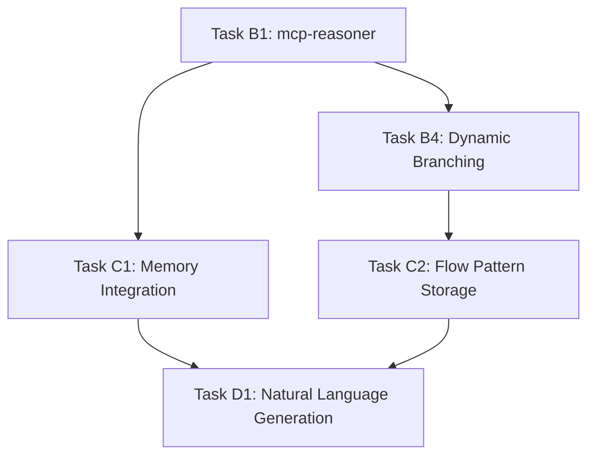

# FLUJO MCP Intelligence Enhancement - Task Implementation Guide

## Overview

This document provides a comprehensive guide to implementing MCP tools and chain of thought management improvements in FLUJO, based on the updated MCP-first prioritization strategy.

## Current Implementation Status

**Active Request**: req-43 (MCP-First Prioritization)  
**Current Task**: task-381 (MCP-Reasoner Integration) - **READY TO START**  
**GitHub Project**: Updated to reflect MCP-first approach  

### Progress Tracking
| Task ID | Title | Status | Priority | GitHub Issue |
|---------|--------|--------|----------|--------------|
| ✅ task-380 | Update PROJECT_PLAN.md | Completed | Done | - |
| 🔄 task-381 | Implement mcp-reasoner Integration | **CURRENT** | Immediate | #5 |
| ⏳ task-382 | Create FlowMemoryService Integration | Next | High | #7 |
| ⏳ task-383 | Dynamic Branching with Sequential-Thinking | Sequential | High | #6 |
| ⏳ task-384 | Create Task Context Documentation | In Progress | Medium | - |
| ⏳ task-385 | Update GitHub Project Structure | Pending | Medium | - |

## Strategic Vision: MCP-First Intelligence Enhancement

### Phase 1: Enhanced MCP Integration (Weeks 1-3) 🧠 **CURRENT PRIORITY**

#### 🔥 IMMEDIATE TASKS

**Task B1: MCP-Reasoner Integration (task-381)**
- **File**: [Task B1 Documentation](./task-b1-mcp-reasoner-integration.md)
- **Issue**: [GitHub Issue #5](https://github.com/joelfuller2016/FLUJO/issues/5)
- **Estimated**: 2-3 hours
- **Dependencies**: None (Ready to start)
- **Deliverable**: Intelligent flow analysis and optimization suggestions

**Task B4: Dynamic Branching Logic (task-383)**
- **File**: [Task B4 Documentation](./task-b4-dynamic-branching.md)
- **Issue**: [GitHub Issue #6](https://github.com/joelfuller2016/FLUJO/issues/6)
- **Estimated**: 4-5 hours
- **Dependencies**: Task B1 (mcp-reasoner)
- **Deliverable**: Context-aware decision making in workflows

#### 🎯 KEY BENEFITS OF MCP-FIRST APPROACH

1. **Foundational Intelligence**: All future features benefit from reasoning capabilities
2. **Chain of Thought Management**: Multi-step reasoning for complex workflows
3. **Context-Aware Processing**: Decisions based on conversation history and execution patterns
4. **Performance Optimization**: Intelligent suggestions for improving flow efficiency
5. **User Experience**: Reduced manual configuration through smart automation

### Phase 2: Memory & Learning (Weeks 4-8)

**Task C1: Memory MCP Server Integration (task-382)**
- **Issue**: [GitHub Issue #7](https://github.com/joelfuller2016/FLUJO/issues/7)
- **Dependencies**: Task B1, B4 (reasoning foundation)
- **Deliverable**: Cross-conversation learning and pattern storage

### Phase 3: Advanced Orchestration (Weeks 9-14)

**Task D1: Natural Language to Flow Generation**
- **Issue**: [GitHub Issue #8](https://github.com/joelfuller2016/FLUJO/issues/8)
- **Dependencies**: Memory integration, reasoning capabilities
- **Deliverable**: AI-powered workflow creation from descriptions

## Technical Architecture

### MCP Server Integration Points

```
FLUJO Core Architecture
├── FlowExecutor.ts (Enhanced with reasoning)
│   ├── mcp-reasoner (Flow analysis & optimization)
│   ├── sequential-thinking (Dynamic branching)
│   └── memory (Pattern storage & learning)
├── BranchingHandler.ts (New - Dynamic decisions)
├── ReasonerIntegrationService.ts (New - Intelligence layer)
└── FlowMemoryService.ts (New - Learning & patterns)
```

### Available MCP Servers
- ✅ **mcp-reasoner**: Advanced reasoning with beam search, MCTS strategies
- ✅ **sequential-thinking**: Step-by-step problem solving with branching
- ✅ **memory**: Knowledge graph for persistent learning
- ✅ **taskmanager**: Task decomposition and workflow management
- ✅ **code-reasoning**: Specialized reasoning for development tasks

## Implementation Dependencies

### Dependency Chain


### Prerequisites
- [x] MCP servers installed in `/mcp-servers/` directory
- [x] GitHub issues created and organized
- [x] PROJECT_PLAN.md updated with MCP-first priorities
- [x] Task documentation created for core implementation

## Getting Started - Developer Guide

### 1. Environment Setup
```bash
# Clone the repository
git clone https://github.com/joelfuller2016/FLUJO.git
cd FLUJO

# Install dependencies
npm install

# Verify MCP servers are available
ls mcp-servers/
# Should show: mcp-reasoner, sequential-thinking, memory, etc.
```

### 2. Next Immediate Action
**Start with Task B1 (task-381) - MCP-Reasoner Integration**

1. Read detailed implementation guide: [Task B1 Documentation](./task-b1-mcp-reasoner-integration.md)
2. Focus on: `src/backend/execution/flow/FlowExecutor.ts`
3. Expected time: 2-3 hours
4. Creates foundation for all intelligent features

### 3. Development Workflow
```bash
# Create feature branch
git checkout -b feature/task-381-mcp-reasoner-integration

# Follow implementation guide
# - Update FlowExecutor.ts with reasoning analysis
# - Create ReasonerIntegrationService.ts
# - Add unit tests and integration tests

# Commit and push
git add .
git commit -m "feat: implement mcp-reasoner integration (task-381)"
git push origin feature/task-381-mcp-reasoner-integration

# Create PR for review
```

## Quality Assurance

### Testing Strategy
- **Unit Tests**: Each MCP integration function
- **Integration Tests**: End-to-end flow execution with reasoning
- **Performance Tests**: Latency impact of intelligent features
- **User Acceptance Tests**: Reasoning insights and optimization suggestions

### Success Metrics
- **Reasoning Accuracy**: 85%+ correct optimization suggestions
- **Performance Impact**: <100ms latency for reasoning operations
- **User Satisfaction**: 90%+ positive feedback on intelligent features
- **Decision Quality**: Measurable improvement in workflow efficiency

## Documentation Structure

### Task-Specific Documentation
- [`task-b1-mcp-reasoner-integration.md`](./task-b1-mcp-reasoner-integration.md) - Foundational reasoning
- [`task-b4-dynamic-branching.md`](./task-b4-dynamic-branching.md) - Intelligent branching logic
- [Additional task docs to be created as needed]

### Architecture Documentation
- [`../architecture/README.md`](../architecture/README.md) - Overall system architecture
- [`../features/mcp/README.md`](../features/mcp/README.md) - MCP integration details
- [`PROJECT_PLAN.md`](../../PROJECT_PLAN.md) - Strategic implementation plan

## Project Management

### Task Tracking System
- **Request ID**: req-43 (MCP-First Prioritization)
- **Tool**: Built-in taskmanager MCP server
- **Progress Visibility**: Real-time task status and approval workflow

### GitHub Integration
- **Issues**: Aligned with task structure (#5, #6, #7, #8)
- **Milestones**: Phase-based organization
- **Projects**: Kanban board for visual progress tracking

### Approval Workflow
1. Complete task implementation
2. Mark task as done with completed details
3. **Wait for user approval** before proceeding
4. Get next task after approval
5. Repeat cycle

## Communication & Updates

### Progress Reporting
- Real-time task status through taskmanager
- Detailed implementation documentation
- GitHub commit history with clear messages
- Updated PROJECT_PLAN.md with current status

### Issue Tracking
- GitHub Issues for major features (#5, #6, #7, #8)
- Task-specific documentation for implementation details
- Progress comments and status updates

## Future Roadmap

### Immediate Focus (Next 2 weeks)
1. **Complete Task B1**: mcp-reasoner integration
2. **Complete Task B4**: Dynamic branching with sequential-thinking
3. **Begin Task C1**: Memory integration for learning

### Medium-term Goals (Weeks 4-8)
1. Cross-conversation learning capabilities
2. User preference tracking and personalization
3. Flow pattern recognition and suggestions

### Long-term Vision (Weeks 9+)
1. Natural language to flow generation
2. Self-optimizing platform capabilities
3. Community pattern sharing

## Contact & Support

### Development Team
- **Repository**: [FLUJO GitHub](https://github.com/joelfuller2016/FLUJO)
- **Issues**: Create GitHub issues for bugs or feature requests
- **Documentation**: All implementation guides in `/docs/tasks/`

### Getting Help
1. Check task-specific documentation first
2. Review GitHub issues for similar problems
3. Create new issue with detailed description
4. Reference task ID and implementation context

---

**Status**: Active Development - MCP-First Implementation  
**Current Focus**: Task B1 (mcp-reasoner Integration)  
**Updated**: June 3, 2025  
**Version**: 1.0 - Initial Implementation Guide